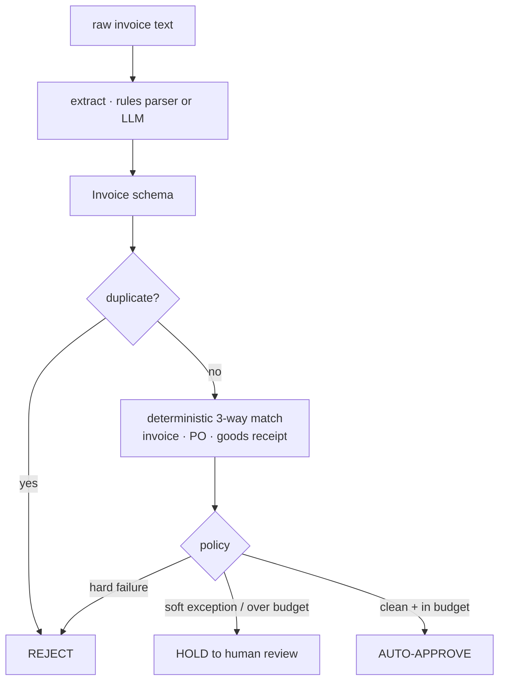

# invoice-ap-agent

> **An agent that knows when *not* to be an agent.** It uses an LLM for the one thing
> models are good at, reading messy invoices, and **deterministic, tested code** for the
> thing models must never freelance: deciding whether to pay. Human-in-the-loop for
> exceptions, and a safety gate that **no bad invoice is ever auto-approved.** Fully offline.

[](https://github.com/tahasiddiquii/invoice-ap-agent/actions/workflows/ci.yml)


Accounts payable is the textbook agentic use case from the 2026 playbooks (OpenAI, MLflow,
IBM): unstructured documents, nuanced judgement, brittle rules. But the lesson those guides
hammer is **reserve the LLM for ambiguity and route anything with a binary-correct answer to
typed code.** This repo does exactly that, and the most impressive thing it does is *not*
use an agent for the part that moves money.

## What this demonstrates

| Production principle | Where |
| --- | --- |
| LLM only for messy extraction (pluggable, validated) | [extraction.py](src/ap_agent/extraction.py) |
| Deterministic 3-way match (invoice / PO / receipt) | [matching.py](src/ap_agent/matching.py) |
| Conservative policy: pay / hold / reject | [policy.py](src/ap_agent/policy.py) |
| Human-in-the-loop review queue | [review.py](src/ap_agent/review.py) |
| Safety gate: zero unsafe auto-approvals | [evals.py](src/ap_agent/evals.py) |

## Architecture



## Quickstart

```bash
make dev            # venv + install -e ".[dev]"

ap-agent run        # process every invoice, print pay/hold/reject + reasons
ap-agent eval       # accuracy + the safety gate
ap-agent demo
```

No keys, no network. Set `AP_EXTRACTOR=openai` to swap the rules parser for a model.

## What it decides

`ap-agent run` over the sample ledger:

| invoice | total | decision | why |
| --- | --- | --- | --- |
| INV-1001 | $99.00 | auto_approve | clean 3-way match |
| INV-1004 | $104.50 | hold_for_review | unit price 10% over PO |
| INV-1005 | $880.00 | reject | billed 8, ordered 5 |
| INV-1006 | $11.00 | reject | no purchase order |
| INV-1007 | $8,800.00 | hold_for_review | over the auto-approve limit |
| INV-1008 | $350.00 | reject | subtotal + tax != total |
| INV-1010 | $550.00 | reject | vendor mismatch |
| INV-1001 (again) | $99.00 | reject | duplicate |

## Evaluation: the gate that matters

`ap-agent eval` replays labeled invoices through the real pipeline
([full report](reports/audit_report_example.md)):

| metric | value | threshold |
| --- | --- | --- |
| decision_accuracy | 1.000 | ≥ 0.90 |
| extraction_accuracy | 1.000 | ≥ 0.95 |
| **unsafe_auto_approvals** | **0** | **= 0** |

The headline isn't the accuracy, it's the **guarantee**: across every invoice, **zero** that
should have been held or rejected were auto-approved. A wrong "hold" wastes a few minutes; a
wrong "pay" is money out the door. The gate enforces the asymmetry, and CI fails if it's ever
violated. (All numbers are produced by the run, never hand-written.)

## Design decisions

- **The LLM never touches the math.** Extraction is the model's job; the 3-way match and the
  decision are deterministic code with a ground-truth ledger, so a stated total can be
  *checked*, not trusted.
- **Hard vs soft exceptions.** Missing PO, math errors, over-billing, and duplicates are hard
  (reject). Price variance and over-budget are soft (human review). The mapping is explicit
  and tested.
- **Conservative by default.** Only a clean, in-budget, fully-matched invoice auto-approves.
  Everything else escalates. Payment is irreversible; the bias is deliberate.
- **Pluggable extraction.** `rules` (offline, default) to `openai`/`anthropic`, behind one
  interface, with the model output validated by the `Invoice` schema.


