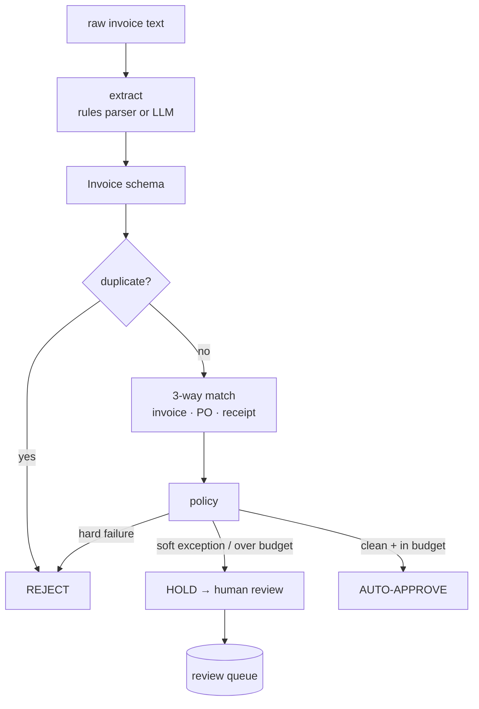

# Architecture

How an invoice flows from raw text to an auditable pay/hold/reject decision.

## Pipeline

## The one place an LLM belongs

Extraction — turning unstructured invoice text into structured fields — is the only step
where a model adds value, and it's pluggable ([extraction.py](src/ap_agent/extraction.py)):
a deterministic rules parser by default, OpenAI/Anthropic with one env var. The model's
output is validated by the `Invoice` pydantic schema before anything downstream sees it.

## Deterministic 3-way match

[matching.py](src/ap_agent/matching.py) compares the invoice against the purchase order
and the goods receipt, producing typed exceptions:

| Exception | Severity | Meaning |
| --- | --- | --- |
| `no_po`, `unknown_sku` | hard | nothing to match against |
| `math_line`, `math_subtotal`, `math_total` | hard | the arithmetic doesn't add up |
| `over_billed_qty` | hard | billed more than ordered |
| `over_billed_receipt` | hard | billed more than received |
| `vendor_mismatch` | hard | wrong vendor |
| `duplicate` | hard | invoice already processed |
| `price_variance` | soft | unit price drifted beyond tolerance |
| `over_budget` | soft | total above the auto-approve limit |

## Policy: conservative by construction

[policy.py](src/ap_agent/policy.py) maps exceptions to a decision: **any hard failure →
reject**, **any soft exception → hold for a human**, **otherwise auto-approve**. Payment is
the irreversible action, so the system is biased toward review — and the CI gate proves it:
`unsafe_auto_approvals` (anything that should've been held/rejected but was paid) must be
exactly **0**.

## Why this matters

The expensive failure mode in AP automation isn't a held invoice — it's an *auto-paid* bad
one. By keeping the decision in deterministic code with a zero-tolerance safety gate, the
"agent" gets the convenience of automation without handing the model the checkbook.
